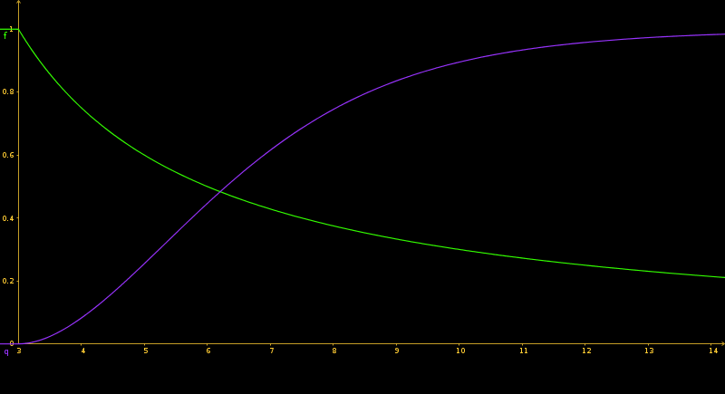

% Driving Control via Fuzzy Logic System 
% 101201046 李庭慶 

## About
### Fuzzy operand
We define that basic fuzzy operands $\wedge$ and $\vee$.
$$
\begin{aligned} 
    a \wedge b  = & 1 - min(1, ((1-a)^w + (1-b)^w)^{\frac{1}{w}})  \\
    a \vee b  = &  min(1, (a^w + b^w)^{\frac{1}{w}}) 
\end{aligned}
$$
where we choose **$w$** is $\sqrt 2$

### Membership function and Fuzzy Set

Because the radius _r_ of car is 3, we can define these
 membership functions as below.

\

Where the Green Function $f(x)$ (**Close**) is 

$$
f(x) = 
\begin{cases}
    \frac{r}{x} & : x > r \\
    1 & : \text{otherwise}
\end{cases}
$$
 
 and the Purple Function $q(x)$ (**Far**) is

$$
q(x) = 
\begin{cases}
    \tanh(\log^2{\frac{x}{r}} ) & : x > r \\
    0 & : \text{otherwise}
\end{cases}
$$

and use $g(x, y) =(f(x)\wedge f(y)) \vee (q(x)\wedge q(y))$
be the **Euqal** of x and y.

And then fuzzy rules are 

* If *left* is **close** and *right* is **far** then $\theta = 40^\circ$
* If *right* is **close** and *left* is **close** then $\theta = -40^\circ$
* If *ceneter* is **close** and (*left*, *right*) is **Equal**
     then $\theta = w(left, right) * 40^\circ$

where the $w(x, y)$ is 
$$
w(x, y) = 
\begin{cases}
    1 & : f(x)*q(y) \geq f(y)*q(x)\\
    -1& : \text{otherwise}
\end{cases}
$$

Finally, use weighted arthimetic mean defuzzier to get real $\theta$.
 
## How to Compile and Run

### Environment Required
- [`CMake`](https://cmake.org/) >= 3.0
- [`GTK3`](http://www.gtk.org/)
- [`Cairo`](http://cairographics.org/) >= 1.14

### Configure
``` sh
cmake THE_SOURCE_DIR_YOU_PUT
```
### How to build
``` sh
make
```

### Run
``` sh 
./auto_mobile
```
